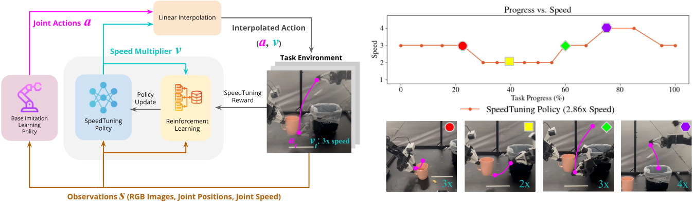

<div align="center">

# SpeedTuning: Speeding Up Policy Execution with Lightweight Reinforcement Learning

[David D. Yuan](https://www.linkedin.com/in/dewei-yuan) ·
[Tony Z. Zhao](https://tonyzhaozh.github.io/) ·
[Kaylee Burns](https://kayburns.github.io/) ·
[Chelsea Finn](https://ai.stanford.edu/~cbfinn/)

Stanford University · ICRA 2025

[Project Page](https://daivdyuan.github.io/speed-tuning/) ·
[arXiv](https://arxiv.org/abs/2608.09138) ·
[Conference Paper](https://daivdyuan.github.io/speed-tuning/static/pdfs/speedtuning_icra.pdf) ·
[Video](https://daivdyuan.github.io/speed-tuning/static/videos/icra2025_final.mp4) ·
[Simulation Reproduction](docs/SCRIPTED_REPRODUCTION.md)

[](https://github.com/DaivdYuan/SpeedTuning/actions/workflows/sim-tests.yml)

</div>

<p align="center">
  <a href="https://daivdyuan.github.io/speed-tuning/">
    
  </a>
</p>

<p align="center"><em>
SpeedTuning keeps a base manipulation policy fixed and learns a lightweight
speed policy that accelerates safe phases while preserving precision around
critical interactions.
</em></p>

> [!NOTE]
> This repository is the simulation reproduction release. It provides complete
> from-scratch speed-policy training with bundled scripted task policies.

## Overview

Imitation-learned manipulation policies often inherit the operator's pace and
the hardware constraints present during data collection. Applying one global
interpolation factor can make execution faster, but it cannot distinguish
between transit phases that tolerate aggressive acceleration and contact-rich
phases that require precision.

SpeedTuning adds a small reinforcement-learning policy on top of a frozen base
policy. At each decision, it selects a speed multiplier from the current robot
and task observation. The base policy continues to predict actions; SpeedTuning
only changes how quickly those actions are executed.

This release supports the full simulation loop:

1. run a task with a fixed scripted base policy;
2. train a Rainbow DQN policy over discrete speed multipliers;
3. evaluate success against physical acceleration;
4. compare the adaptive policy with matched fixed-speed baselines.

## Included tasks

| Task | Simulator objective | Public preset |
| --- | --- | --- |
| Pick-and-place | Transfer a cube between grippers | `scripted-pick-and-place` |
| Insertion | Insert a peg into a socket | `scripted-insertion` |
| Tea bag | Move a tea bag into a cup | `scripted-tea-bag` |

An additional `scripted-tea-bag-randomized` preset samples initial tea-bag poses
for distributional evaluation. The retained fixed-pose environment remains
available for historical parity.

## Installation

Python 3.10 is required. MuJoCo and DM Control are pinned because contact
dynamics affect the scripted policies.

Using `uv`:

```bash
git clone https://github.com/DaivdYuan/SpeedTuning.git
cd SpeedTuning

uv sync --extra test
uv run speedtuning-sim
```

Using `pip`:

```bash
python3.10 -m venv .venv
source .venv/bin/activate
python -m pip install -e ".[test]"
speedtuning-sim
```

On a headless Linux machine, prefix simulator commands with `MUJOCO_GL=egl`.

## Quick simulation check

Run all three scripted tasks at nominal speed:

```bash
uv run speedtuning-sim
```

Run one task with a fixed `1.5x` speed multiplier:

```bash
uv run speedtuning-sim --task insertion --speed 1.5
```

Each command prints a JSON summary and exits nonzero if the task fails.

## Train a speed policy

Install the reinforcement-learning extra and run a short CPU smoke test:

```bash
uv sync --extra rl --extra test

uv run speedtuning-train-speed \
  --config scripted-tea-bag \
  --task tea_bag \
  --decisions 1000 \
  --checkpoint-interval 0 \
  --output outputs/smoke_test.pt
```

For a full 100,000-decision run, use the preset without the smoke-test
overrides:

```bash
uv run speedtuning-train-speed \
  --config scripted-tea-bag \
  --task tea_bag \
  --output outputs/tea_bag_speed.pt \
  --report outputs/tea_bag_speed.training.json
```

Training defaults to CPU. Add `--device cuda` when CUDA is available. Hardware
changes wall-clock time, not the simulation protocol or acceleration metric.

Every full preset trains a separate task-specific policy. Generated checkpoints
and reports are written under the ignored `outputs/` directory; no pretrained
artifact is required or distributed.

## Evaluate

Evaluate the learned speed policy:

```bash
uv run speedtuning-eval-speed \
  --config scripted-tea-bag \
  --task tea_bag \
  --speed-policy rainbow \
  --speed-checkpoint outputs/tea_bag_speed.pt \
  --episodes 20
```

Measure a fixed-speed frontier:

```bash
uv run speedtuning-sweep \
  --config scripted-tea-bag \
  --task tea_bag \
  --speed-start 1.0 --speed-stop 3.0 --speed-step 0.25 \
  --episodes-per-speed 20 \
  --output outputs/tea_bag_sweep.json
```

Physical acceleration is the nominal task horizon divided by the number of
executed MuJoCo steps. It is not the arithmetic mean of commanded multipliers.

## Simulation reference results

One seeded run using the final checkpoint from each 100,000-decision training
run produced:

| Protocol | Adaptive SpeedTuning | Matched fixed speed |
| --- | --- | --- |
| Pick-and-place | 98% success at 3.856x | 66% at 3.846x |
| Insertion | 97% success at 2.387x | 52% at 2.381x |
| Tea bag, randomized poses | 78% success at 2.077x | 24% at 2.075x |

These are reference points in the pinned simulator, not exact-decimal
guarantees. Reinforcement learning is stochastic; reruns should be compared by
the success/acceleration tradeoff.

See the [full reproduction guide](docs/SCRIPTED_REPRODUCTION.md) for reward and
update definitions, all-task commands, pose protocols, and seeded evaluation.
The compact machine-readable record is
[`benchmarks/scripted_results.json`](benchmarks/scripted_results.json).

## Bring your own task policy

The speed controller can wrap an external policy that returns action chunks with
shape `[time, 14]`. A `module:factory` adapter makes it possible to train or
evaluate another repository's task policy without modifying this codebase.

See [External task-policy integration](docs/EXTERNAL_POLICIES.md) for:

- the Python and CLI interfaces;
- ACT checkpoint and normalization support;
- visual, state, and external speed-policy observations;
- the archival learned-policy configuration and ablations.

## Segment-independent reference alignment

The experimental [online reference-alignment probe](docs/REFERENCE_ALIGNMENT.md)
maps causal video clips to a continuous position in one reference execution.
It keeps visual correspondence separate from editable segment and playback-speed
metadata; changing a segment boundary requires no model retraining.

## Future semantic-phase chunk control

The experimental [future semantic-phase prototype](docs/FUTURE_SEMANTIC_PHASES.md)
predicts stable phase IDs across a proposed action chunk and selects the
largest configured stride that cannot skip into a slower phase or cross a
gripper transition.  It supports named offline `semantic_phase_id` labels and
keeps the deployed predictor limited to current observations plus the proposed
action chunk.

## Commands

| Command | Purpose |
| --- | --- |
| `speedtuning-sim` | Run scripted simulator tasks at a fixed speed |
| `speedtuning-train-speed` | Train a Rainbow speed policy |
| `speedtuning-eval-speed` | Evaluate fixed, profiled, or learned speed policies |
| `speedtuning-sweep` | Build a success-versus-acceleration curve |
| `speedtuning-check-chunks` | Validate action-chunk integration |
| `speedtuning-rainbow-poc` | Run a small Rainbow optimization check |

## Scope and limitations

- This release reproduces the methodology with scripted base policies in
  simulation; it does not claim to reproduce the paper's learned-ACT table.
- Real-robot execution is not part of the supported API.
- External task policies remain responsible for their architectures,
  preprocessing, normalization statistics, and checkpoint compatibility.
- The physics stack is intentionally pinned for reproducibility.

## Citation

If you use this code, please cite:

```bibtex
@inproceedings{yuan2025speedtuning,
  title     = {{SpeedTuning}: Speeding Up Policy Execution with Lightweight Reinforcement Learning},
  author    = {Yuan, David D. and Zhao, Tony Z. and Burns, Kaylee and Finn, Chelsea},
  booktitle = {2025 IEEE International Conference on Robotics and Automation (ICRA)},
  year      = {2025},
  doi       = {10.1109/ICRA55743.2025.11128753}
}
```

Citation metadata is also available in [`CITATION.cff`](CITATION.cff).

## License and acknowledgments

SpeedTuning is released under the MIT License. The ACT-derived DETR code under
`detr/` retains its Apache-2.0 license. Simulator assets and upstream attribution
are documented in [`NOTICE.md`](NOTICE.md).
